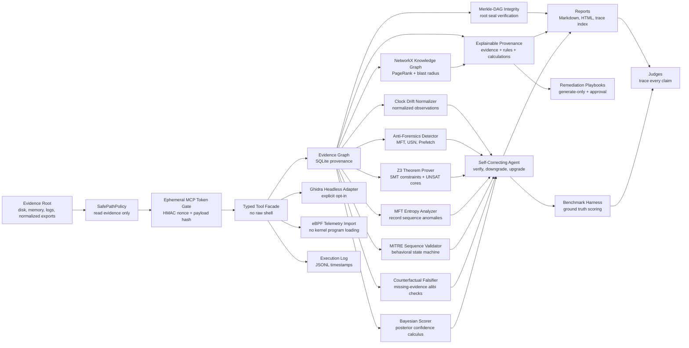

# Architecture

ProofSIFT uses the **Custom MCP Server / typed tool** strategy because the challenge explicitly values architectural guardrails over prompt-only rules.



## Trust Boundaries

| Boundary | Enforcement |
| --- | --- |
| Evidence reads | `SafePathPolicy.validate_read()` allows only configured evidence roots. |
| Evidence writes | `SafePathPolicy.validate_write()` allows only output directory writes. |
| Tool invocation | Agent calls typed Python functions, not arbitrary shell commands. |
| Ephemeral tool authorization | Each tool execution receives a one-time HMAC-SHA256 nonce envelope bound to the typed payload. Replays are rejected. |
| Confirmed findings | Verification gate requires independent evidence kinds. |
| Time normalization | Clock drift is written to derived observations only; source artifacts are untouched. |
| Anti-forensics | MFT, USN, and Prefetch are compared as typed artifacts and stored as derived anomalies. |
| Formal timeline verification | Z3 stores `UNSAT` proofs, tracked cores, solver version, and SMT-LIB when observed timestamps cannot satisfy causal constraints. |
| Metadata entropy | MFT record-number gaps and timestamp density are scored as a separate structural timestomping signal. |
| MITRE sequencing | High-impact claims trigger typed tool recommendations instead of free-form shell exploration. |
| Counterfactual falsification | High-impact claims must satisfy expected OS side effects; missing Shimcache, Amcache, Prefetch, Event ID 4688, MFT, or USN evidence denies escalation. |
| Bayesian scoring | Claim confidence is recalculated with `P(H|E)=P(E|H)*P(H)/P(E)` and persisted in `bayesian_scores`. |
| Chain of custody | `proofsift verify-integrity` computes a Merkle-DAG root over artifacts, claims, signed relationship blocks, corrections, scoring records, BMC results, entropy analyses, and tool authorizations. |
| Knowledge graph | NetworkX builds typed entity relationships and stores PageRank center-of-gravity and blast-radius metrics. |
| Native collectors | Ghidra is explicit opt-in; eBPF is read-only telemetry import; unavailable capabilities are logged and degrade gracefully. |
| Explainability | Durable evidence, rules, and calculations are exposed. Hidden model chain-of-thought and private prompts are not stored. |
| Remediation | Commands are generated as reviewable strings with approval, validation, rollback, and `WhatIf` safeguards; no command is executed. |
| Auditability | Tool results, artifacts, claims, corrections, and traces are stored. |

## Agent Loop

```text
1. Register and hash evidence.
2. Run spoliation probe.
3. Collect memory and network artifacts.
4. Create initial hypotheses.
5. Verify and downgrade weak claims.
6. Run disk, registry, event, timeline, and IOC tools when gaps exist.
7. Normalize source clock drift through the observations table.
8. Correlate memory and disk evidence.
9. Detect timestomping and anti-forensics anomalies.
10. Prove timeline contradictions with Z3 satisfiability checking.
11. Score MFT record-sequence entropy for structural metadata anomalies.
12. Validate MITRE ATT&CK behavioral sequence.
13. Run counterfactual alibi checks for missing OS side effects.
14. Recalculate Bayesian posterior confidence.
15. Build the NetworkX attack graph and rank center-of-gravity/blast radius.
16. Generate evidence-and-rule provenance traces.
17. Generate approval-gated, non-executing response playbooks.
18. Seal every advanced record with a Merkle-DAG root.
19. Upgrade only if independent artifacts agree.
20. Apply negative controls.
21. Generate report, trace index, and benchmark outputs.
```

## Architectural vs Prompt Guardrails

Architectural:

- No raw shell tool is exposed.
- Evidence write validation fails by construction.
- Confirmed claim status is computed by verifier logic.
- Every claim must link to stored artifact IDs.

Prompt-level:

- The project story asks the agent to think like a senior analyst.
- Report language reminds users that inferred claims are not confirmed.

The scoring bet is that architectural guardrails matter more to judges than eloquent prompts.
