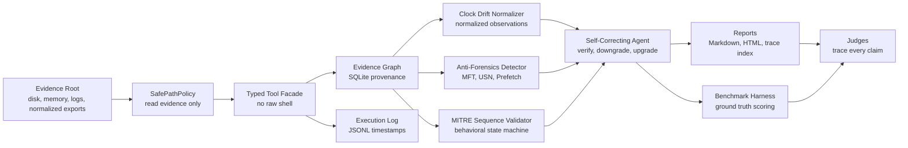

# Architecture

ProofSIFT uses the **Custom MCP Server / typed tool** strategy because the challenge explicitly values architectural guardrails over prompt-only rules.



## Trust Boundaries

| Boundary | Enforcement |
| --- | --- |
| Evidence reads | `SafePathPolicy.validate_read()` allows only configured evidence roots. |
| Evidence writes | `SafePathPolicy.validate_write()` allows only output directory writes. |
| Tool invocation | Agent calls typed Python functions, not arbitrary shell commands. |
| Confirmed findings | Verification gate requires independent evidence kinds. |
| Time normalization | Clock drift is written to derived observations only; source artifacts are untouched. |
| Anti-forensics | MFT, USN, and Prefetch are compared as typed artifacts and stored as derived anomalies. |
| MITRE sequencing | High-impact claims trigger typed tool recommendations instead of free-form shell exploration. |
| Auditability | Tool results, artifacts, claims, corrections, and traces are stored. |

## Agent Loop

```text
1. Register and hash evidence.
2. Run spoliation probe.
3. Collect memory and network artifacts.
4. Create initial hypotheses.
5. Verify and downgrade weak claims.
6. Run disk, registry, event, timeline, and IOC tools when gaps exist.
7. Normalize source clock drift through the observations table.
8. Correlate memory and disk evidence.
9. Detect timestomping and anti-forensics anomalies.
10. Validate MITRE ATT&CK behavioral sequence.
11. Upgrade only if independent artifacts agree.
12. Apply negative controls.
13. Generate report, trace index, and benchmark outputs.
```

## Architectural vs Prompt Guardrails

Architectural:

- No raw shell tool is exposed.
- Evidence write validation fails by construction.
- Confirmed claim status is computed by verifier logic.
- Every claim must link to stored artifact IDs.

Prompt-level:

- The project story asks the agent to think like a senior analyst.
- Report language reminds users that inferred claims are not confirmed.

The scoring bet is that architectural guardrails matter more to judges than eloquent prompts.
