## Inspiration

The SANS Find Evil hackathon demands autonomous DFIR triage that judges can trust at a glance. Existing AI forensic tools produce unstructured narrative reports with no way to verify whether a finding is real or hallucinated — a critical failure for incident response where false positives waste hours and missed indicators miss breaches.

ProofSIFT was built on one enforceable principle: **the agent cannot issue a confirmed finding unless it can prove the finding with traceable forensic evidence.** Every claim is linked to the exact artifact, parser tool, command UUID, timestamped JSONL audit event, and SHA-256 evidence hash that produced it. This architecture maps directly to every Find Evil judging criterion:

| Judging Criterion | ProofSIFT Implementation | Evidence |
|:---|:---|---:|
| 🎯 Autonomous execution quality | Deterministic `Plan -> Collect -> Hypothesize -> Verify -> Correct -> Report` loop with configurable max-iteration caps | `agent.py:36-98` — ordered tool dispatch, verification gates, iteration boundaries |
| 🛡️ IR accuracy | CONFIRMED requires >= 2 independent artifact kinds; unsupported claims auto-downgraded; negative controls prevent benign escalation | `agent.py:284-309` — `_verify_claims` gate; `agent.py:311-325` — `_negative_controls` |
| 🔬 Breadth and depth | 16 typed tools across memory, network, execution, registry, filesystem, event logs, and IOC scans | `tools.py:31-49` — full tool catalog with typed contracts |
| 🔒 Constraint implementation | SafePathPolicy blocks evidence writes; typed facade replaces shell access; spoliation probe proves boundary | `security.py:12-41` — read/write validation and automated probe |
| 📋 Audit trail quality | JSONL execution log, SQLite evidence graph, `proofsift trace` CLI, Markdown + HTML reports with correction history | `audit.py`, `graph.py`, `reporting.py` — full audit pipeline |
| 📖 Usability | Zero runtime dependencies for demo mode; runs on any Python 3.10+ system; SIFT integration documented | `requirements.txt` — only 3 optional packages |

---

## What it does

ProofSIFT is an **evidence-proven, self-correcting autonomous DFIR triage agent** that autonomously investigates Windows forensic evidence through a deterministic multi-iteration loop, producing auditable findings with full provenance traceability.

```mermaid
flowchart TD
    START([🔍 Case Loaded]) --> HASH[⚙️ hash_all_evidence<br/>SHA-256 every file]
    HASH --> SPOLIATION[⚙️ spoliation_probe<br/>Prove writes blocked]
    SPOLIATION --> ITER1

    subgraph ITER1 [Iteration 1 — Memory & Network Triage]
        direction LR
        PSLIST[🧠 memory_pslist<br/>Process list] --> PSSCAN[🧠 memory_psscan<br/>Hidden processes]
        PSSCAN --> NETSCAN[🌐 memory_netscan<br/>Network connections]
        NETSCAN --> MALFIND[🧠 memory_malfind<br/>Injected memory]
        MALFIND --> HYPOTHESIZE[📝 Generate C2 hypotheses<br/>Match remote_IP in c2_ips]
        HYPOTHESIZE --> VERIFY1[🔍 _verify_claims<br/>Downgrade unsupported CONFIRMED]
        VERIFY1 --> MITRE1[🧩 _validate_mitre_sequence<br/>Check tactic prerequisites]
    end

    MITRE1 --> DECIDE{needs_disk<br/>corroboration?}
    DECIDE -->|YES, iteration 2| ITER2
    DECIDE -->|NO| ITER3

    subgraph ITER2 [Iteration 2 — Disk Corroboration]
        direction TB
        PREFETCH[💾 disk_prefetch<br/>Execution artifacts] --> AMCACHE[💾 disk_amcache<br/>Program inventory]
        AMCACHE --> SHIMCACHE[💾 disk_shimcache<br/>AppCompat execution]
        SHIMCACHE --> AUTORUNS[📝 registry_autoruns<br/>Persistence points]
        AUTORUNS --> MFT[📂 timeline_mft<br/>Filesystem timeline]
        MFT --> USN[📂 timeline_usn<br/>USN journal]
        USN --> EVTX[📋 windows_evtx<br/>Event logs + Process creation]
        EVTX --> PSLOG[📋 powershell_logs<br/>PowerShell activity]
        PSLOG --> YARA[🔎 yara_keyword_scan<br/>IOC keyword matching]
        YARA --> DRIFT[⏰ _normalize_clock_drift<br/>Discover + apply +120s offset]
        DRIFT --> CORRELATE[🔗 _correlate_disk_memory<br/>Cross-source matching]
        CORRELATE --> AF[🔍 _apply_anti_forensics<br/>Timestomping detection]
        AF --> VERIFY2[🔍 _verify_claims<br/>Upgrade/downgrade]
        VERIFY2 --> MITRE2[🧩 _validate_mitre_sequence<br/>Re-check gaps]
    end

    ITER2 --> ITER3

    subgraph ITER3 [Iteration 3 — Negative Controls]
        NEG[🛡️ _negative_controls<br/>Verify svchost.exe not escalated]
        NEG --> VERIFY3[🔍 _verify_claims<br/>Final verification]
    end

    ITER3 --> REPORT[📊 write_reports<br/>Markdown + HTML + trace_index + JSONL]
    REPORT --> BENCHMARK([🏆 Benchmark against ground_truth.json])
    BENCHMARK --> END([✅ Done: precision, recall, scores])
```



### Demo case walkthrough

The bundled demo case (`cases/demo_case/`) contains a realistic malicious chain with deliberate controls:

| Evidence File | Content | Forensic Purpose |
|:---|---|:---|
| `processes.csv` | svchost.exe (PID 412), explorer.exe (632), **evil.exe (1888, psscan)**, powershell.exe (2100) | Process listings from both pslist and psscan sources |
| `netscan.csv` | svchost.exe->10.0.2.2:53, **evil.exe->203.0.113.50:443**, unknown.exe->198.51.100.24:443 | C2 indicators with one weak signal |
| `prefetch.csv` | POWERSHELL.EXE (1 run), **EVIL.EXE (3 runs)** | Execution count and last-run timestamps |
| `amcache.csv` | **evil.exe** (SHA-256, unsigned), powershell.exe (Microsoft signed) | Program execution inventory |
| `shimcache.csv` | **evil.exe**, powershell.exe | Application compatibility cache |
| `mft.csv` | **evil.exe** (created 14:10:05Z, modified 14:02:05Z), invoice.docm | MFT timestamps showing timestomping anomaly |
| `usn.csv` | **evil.exe** FILE_CREATE (14:02:05Z), BASIC_INFO_CHANGE (14:02:25Z) | USN journal entries |
| `evtx.csv` | 4624 logon from 203.0.113.50, 4688 process creation (powershell + evil.exe), 7045 failed service | Event logs with clock drift anchor |
| `malfind.csv` | **evil.exe** PID 1888, PAGE_EXECUTE_READWRITE, MZ header | Injected memory region |
| `autoruns.csv` | **Updater -> evil.exe** in HKCU\Run, legitimate OneDrive | Registry persistence |
| `payload_notes.txt` | "evil beacon initialized", "c2 channel: 203.0.113.50:443" | Keyword/YARA IOC match |

### Expected behavior verified by benchmark

| Artifact | Expected Status | Actual Status | Evidence Sources | Rationale |
|:---|:---:|:---:|:---|---:|
| **evil.exe -> 203.0.113.50:443** | ✅ CONFIRMED | ✅ CONFIRMED | process + network + prefetch + amcache + shimcache + MFT + EVTX + USN + malfind + yara + process_creation | 10+ artifact kinds across memory, disk, and logs |
| **evil.exe HKCU persistence** | ✅ CONFIRMED | ✅ CONFIRMED | autorun + process + prefetch + amcache + MFT + EVTX | Autorun path matches execution corroboration |
| **unknown.exe -> 198.51.100.24:443** | ❌ NOT CONFIRMED | ✅ INFERRED correctly | network only | Single-source, no disk evidence — correctly not escalated |
| **svchost.exe malicious** | ❌ NOT CONFIRMED | ✅ POSSIBLE correctly (INFO) | process only | Negative control — correctly retained as context |
| **EVTX +120s drift** | ✅ Detected | ✅ Detected | netscan + evtx shared anchor (203.0.113.50) | Clock drift normalized across sources |
| **MFT timestomping** | ✅ Detected | ✅ Detected | MFT created 14:10:05Z vs Prefetch last_run 14:02:13Z | Anti-forensics anomaly flagged |

---

## How we built it

### 🏗️ Architecture overview

```
┌─────────────────────────────────────────────────────────────────────┐
│                        CLI (cli.py)                                  │
│  run │ benchmark │ trace │ list-tools │ mcp-stdio                   │
└──────────┬──────────────────────────────────────────────────────────┘
           │
┌──────────▼──────────────────────────────────────────────────────────┐
│                    SelfCorrectingInvestigator (agent.py)             │
│  Deterministic loop: Iteration 1 (memory) → 2 (disk) → 3 (negatives)│
│  Verification gates, correlation engine, negative controls          │
└───────┬──────────┬──────────┬──────────┬──────────┬─────────────────┘
        │          │          │          │          │
┌───────▼──┐ ┌──────▼───┐ ┌──▼──────┐ ┌─▼───────┐ ┌▼──────────────┐
│ ToolRunner│ │ClockDrift│ │AntiFor- │ │MitreSeq-│ │ EvidenceGraph │
│ (tools.py)│ │Normalizer│ │ensics   │ │uenceVal-│ │ (graph.py)    │
│ Typed,    │ │(clock_dr-│ │Detector │ │idator   │ │ SQLite store  │
│ read-only │ │ift.py)   │ │(anti_fo-│ │(mitre_s-│ │ Commands,     │
│ facade    │ │Anchor    │ │rensics  │ │equence. │ │ artifacts,    │
│ 16 tools  │ │matching  │ │.py)     │ │py)      │ │ claims, corrs │
└───────────┘ └──────────┘ └─────────┘ └─────────┘ └───────┬────────┘
                                                            │
┌───────────────────────────────────────────────────────────▼────────┐
│                        Security Layer (security.py)                 │
│  SafePathPolicy: read from evidence roots, write to output only    │
│  Spoliation probe: automated write-block verification              │
│  SHA-256 hashing before analysis                                   │
└────────────────────────────────────────────────────────────────────┘
```

### 🔧 Component breakdown

| Component | Module | Responsibility | Key Classes/Functions |
|:---|---|:---|---|
| **Typed Tool Facade** | `tools.py` | 16 read-only forensic tools; CSV/text parsing with anomaly recording | `ToolRunner` — `memory_pslist()`, `disk_prefetch()`, `yara_keyword_scan()`, etc. |
| **Evidence Graph** | `graph.py` | SQLite relational store for all provenance data | `EvidenceGraph` — `record_tool_result()`, `upsert_claim()`, `add_correction()`, `trace_claim()` |
| **Agent Loop** | `agent.py` | Deterministic investigation orchestration | `SelfCorrectingInvestigator` — `run()`, `_network_hypotheses()`, `_correlate_disk_memory()`, `_verify_claims()`, `_negative_controls()` |
| **Clock Drift** | `clock_drift.py` | Cross-source timestamp alignment | `ClockDriftNormalizer` — `discover_and_apply()`, `_find_anchor()` |
| **Anti-Forensics** | `anti_forensics.py` | Timestomping detection across MFT/USN/Prefetch | `AntiForensicsDetector` — `detect()`, 3 anomaly types |
| **MITRE Sequence** | `mitre_sequence.py` | Tactic prerequisite validation and gap recommendations | `MitreSequenceValidator` — `validate()`, `_recommendation()` |
| **Security Policy** | `security.py` | Read/write path enforcement | `SafePathPolicy` — `validate_read()`, `validate_write()`, `assert_no_evidence_write()` |
| **Audit Logging** | `audit.py` | Append-only JSONL event stream | `AuditLogger` — `event()`, `timed()` |
| **Reporting** | `reporting.py` | Markdown/HTML report generation | `write_reports()`, `_markdown()`, `_html()` |
| **Benchmark** | `benchmark.py` | Ground-truth scoring (precision, recall) | `run_benchmark()`, `_accuracy_markdown()` |
| **CLI** | `cli.py` | Command-line interface | `main()` — run, benchmark, trace, list-tools, validate-submission, mcp-stdio |
| **MCP Bridge** | `mcp_server.py` | JSON-RPC stdio typed operation server | `serve_stdio()` |

### 🔒 Security architecture

ProofSIFT enforces a three-layer security model entirely in code — not through prompts:

| Layer | Enforcement Point | Mechanism | Verification |
|:---|---|:---|---|
| **Read boundary** | `SafePathPolicy.validate_read()` | Resolves path and checks it falls under registered evidence roots; rejects any path outside | Automated spoliation probe writes a file to evidence root and verifies rejection |
| **Write boundary** | `SafePathPolicy.validate_write()` | Resolves path and checks it falls under the output directory only | Output files (reports, graph, logs) are written only through this gate |
| **Tool access** | `ToolRunner` methods | No raw `subprocess` or `os.system` calls; all forensic access is through typed Python methods with structured output | 16 tools in catalog, each with documented guardrail |

### 📊 Data model: SQLite evidence graph schema

```sql
-- Core entities
tool_runs (command_id PK, tool_name, ok, summary, warnings_json, error, duration_ms)
artifacts (artifact_id PK, kind, source, command_id FK, fields_json)
claims (claim_id PK, statement, status, confidence, severity, rationale, contradictions_json, mitre_json)
claim_evidence (claim_id FK, artifact_id FK)  -- many-to-many join
corrections (correction_id PK, iteration, claim_id FK, before_json, after_json, reason)

-- Observations & temporal analysis
observations (observation_id PK, artifact_id FK, kind, source, timestamp_field, observed_utc, normalized_utc, drift_seconds, confidence, notes)
clock_drifts (drift_id PK, source, reference_source, delta_seconds, anchor_observation_id FK, reference_observation_id FK, confidence, reason)
anomalies (anomaly_id PK, kind, target, severity, confidence_multiplier, evidence_json, details_json)

-- MITRE ATT&CK analysis
sequence_recommendations (recommendation_id PK, gap_type, reason, target_claim_id FK, required_tactics_json, recommended_tools_json, recommended_paths_json, priority)
```

Every claim can be traced through `claim_evidence -> artifacts -> tool_runs` to produce a full provenance chain. The `proofsift trace --graph <path> --claim-id <id>` command prints this chain as JSON.

### ⏰ Clock drift: how it works

1. **Extraction** — All artifacts are scanned for known timestamp fields (`created_utc`, `modified_utc`, `first_seen`, `last_run_utc`, `time_utc`) which are extracted into the `observations` table with both observed and normalized values.
2. **Anchor discovery** — The normalizer searches across reference source (e.g., `netscan` with `remote_ip`) and candidate source (e.g., `evtx` with event message) for shared values. In the demo, remote IP `203.0.113.50` appears in both netscan and EVTX 4624 logon message.
3. **Delta calculation** — The timestamp difference between matched anchor observations is computed. Demo: `netscan.first_seen` = `14:03:30Z`, `evtx.time_utc` = `14:01:30Z` → delta = `+120` seconds.
4. **Application** — All EVTX observations are normalized by adding 120 seconds to their `normalized_utc` values. Subsequent `normalized_observations_between()` queries return drift-corrected results.

### 🔍 Anti-forensics: three anomaly detectors

| Anomaly Type | Detection Logic | Confidence Multiplier | Demo Trigger |
|:---|---|:---:|---|
| `mft_creation_postdates_prefetch_execution` | MFT `created_utc` > Prefetch `last_run_utc` by > 300s | 1.12x | evil.exe MFT created 14:10:05Z, Prefetch last run 14:02:13Z (skew = 472s) |
| `mft_created_after_modified` | MFT `created_utc` > MFT `modified_utc` | 1.08x | evil.exe created 14:10:05Z, modified 14:02:05Z |
| `mft_creation_postdates_usn_activity` | MFT `created_utc` > USN `time_utc` by > 300s | 1.10x | evil.exe USN FILE_CREATE at 14:02:05Z, MFT created at 14:10:05Z |

### 🧩 MITRE ATT&CK sequence validation

```
Tactic order: Initial Access → Execution → Persistence → ... → Command and Control → Exfiltration → Impact

High-impact tactics require prerequisites:
  Command and Control  → requires Execution
  Credential Access    → requires Execution

When a C2 claim exists without Execution evidence, the validator emits:
  - Gap: missing_preceding_behavior_for_command_and_control
  - Recommended tools: disk_prefetch, disk_amcache, memory_psscan, windows_evtx
  - Recommended paths: C:\Windows\Prefetch\*.pf, Amcache.hve, Security.evtx Event ID 4688
```

---

## Challenges we ran into

### 🔒 Security boundary enforcement

The most critical design constraint was implementing read-only evidence access that is verifiable by code inspection — not by trusting a prompt. The SafePathPolicy resolves every file path and checks it against registered evidence roots using `Path.relative_to()`. Write validation works similarly against the output directory. An automated spoliation probe (`spoliation_probe()`) writes a sentinel file to the evidence root and asserts the operation is rejected. If the probe unexpectedly succeeds, the tool runner raises a `PolicyViolation` exception and halts execution.

### 🔗 Cross-source temporal correlation

Memory network evidence (netscan), event logs (EVTX), filesystem metadata (MFT), and journal entries (USN) each record timestamps from potentially different clock sources. Aligning them required building an observation extraction pipeline that: (1) automatically identifies timestamp fields via a whitelist (`TIMESTAMP_FIELDS` in `time_utils.py`), (2) parses and normalizes ISO 8601 UTC timestamps, (3) stores both observed and normalized values in the observations table, (4) supports drift-corrected range queries across source boundaries, and (5) records parsing failures as low-confidence observations rather than crashing.

### 🎭 Hallucination prevention

The agent must resist escalating weak signals. The CONFIRMED status verification gate (`_verify_claims()`) requires evidence from at least two independent artifact kinds (e.g., "process" + "network" is insufficient; "network" + "prefetch" + "mft" is sufficient). Any CONFIRMED claim with fewer than two kinds is automatically downgraded to INFERRED with a recorded contradiction. The negative-control handler (`_negative_controls()`) explicitly iterates over benign process names, creates POSSIBLE/INFO claims for them, and the verification gate prevents escalation.

### ⏱️ Self-correction traceability

Every agent decision — hypothesis creation, downgrade, upgrade, confidence adjustment, clock drift normalization, anti-forensics adjustment, MITRE sequence gap detection — is recorded as a structured correction event in the SQLite `corrections` table and emitted to the JSONL execution log. Each correction captures: iteration number, target claim ID (or null for system-level events), before/after JSON snapshots, human-readable reason, and estimated token usage. This lets judges replay the agent's full reasoning chain.

---

## Accomplishments that we're proud of

### 🏆 Perfect benchmark: precision 1.0, recall 1.0

```
┌────────────────────────────────────────────────────────────────────┐
│                        BENCHMARK SCORECARD                          │
├────────────────────────────────────────────────────────────────────┤
│  Metric                          Result      Status                │
│  ──────────────────────────────────────────────────────────────    │
│  Expected confirmed matched      2 / 2       ✅ All evil.exe found │
│  Forbidden confirmed (FP)        0           ✅ No false positives │
│  Hallucinated confirmed          0           ✅ No hallucinations  │
│  Expected anomalies matched      2 / 2       ✅ MFT timestomping   │
│  Expected clock drifts matched   1 / 1       ✅ +120s EVTX drift   │
│  Precision                       1.0         ✅                    │
│  Recall                          1.0         ✅                    │
│  Overall                         PASSED      ✅                    │
└────────────────────────────────────────────────────────────────────┘
```

### 🧠 75 advanced features — fully specified and implemented

Every feature listed in the README is implemented in code and covered by the test suite. The feature set spans:

| Category | Features | Implementation |
|:---|---|:---|
| 🔒 **Security & Constraints** | 1-7 | Typed facade, read-only policy, output-only write, spoliation probe, SHA-256 hashing, SafePathPolicy, file mode audit |
| 🗃️ **Evidence Graph** | 6-10 | SQLite graph, claim-artifact provenance, tool-run provenance, timestamped execution log, token estimation |
| 🔄 **Self-Correction** | 11-18 | Max-iteration loop, downgrade gate, upgrade gate, 4 claim states, confidence scoring, severity scoring, MITRE technique tags |
| 🧠 **Memory Parsers** | 19-22 | Process list, hidden process scan, network connections, malfind injected memory |
| 💾 **Disk Parsers** | 23-28 | Prefetch, Amcache, Shimcache, autoruns, MFT, USN |
| 📋 **Log Parsers** | 29-31 | EVTX, Security 4688, PowerShell logs |
| 🔎 **IOC Scanning** | 32-36 | Keyword YARA scan, cross-source correlation, negative-control handling, benchmark harness, precision/recall |
| 📊 **Reporting** | 37-39 | Markdown report, strict-review report_2, HTML report |
| 🔌 **MCP Bridge** | 40 | Stdio JSON-RPC typed bridge |
| ⏰ **Clock Drift** | 41-50 | Observations table, automatic extraction, drift anchors, network-EVTX matching, delta calculation, normalized updates, indexed queries, audit events, correction traces, report section |
| 🔍 **Anti-Forensics** | 51-58 | MFT-Prefetch timestomping, MFT-USN timestomping, created-after-modified, anomaly table, confidence multipliers, audit events, claim adjustment, report section |
| 🧩 **MITRE ATT&CK** | 59-68 | Tactic mapping, behavioral state machine, C2 validation, Credential Access validation, Execution prerequisite detection, tool recommendations, path recommendations, audit events, correction traces, report section |
| 🛡️ **Parser Resilience** | 69-71 | Parser anomaly artifacts, graceful degradation, error capture without modification |
| 🧪 **Testing** | 72-75 | Expanded benchmark scoring, advanced verification tests, clock drift fixture, anti-forensics fixture |

### 📐 Clean architectural separation

```
src/proofsift/
├── __init__.py          # Package metadata
├── __main__.py          # Entry: python -m proofsift
├── agent.py             # SelfCorrectingInvestigator — orchestration loop
├── anti_forensics.py    # AntiForensicsDetector — timestomping analysis
├── audit.py             # AuditLogger — JSONL event stream
├── benchmark.py         # run_benchmark — ground-truth scoring
├── cli.py               # CLI — run, benchmark, trace, list-tools, validate, mcp-stdio
├── clock_drift.py       # ClockDriftNormalizer — cross-source timestamp alignment
├── graph.py             # EvidenceGraph — SQLite provenance store
├── mcp_server.py        # JSON-RPC stdio bridge for Protocol SIFT
├── mitre_sequence.py    # MitreSequenceValidator — tactic state machine
├── models.py            # Data classes: Artifact, Claim, ToolResult, CaseConfig, etc.
├── reporting.py         # Markdown/HTML report generators
├── security.py          # SafePathPolicy, SHA-256, path validation
├── time_utils.py        # Timestamp parsing, formatting, UTC helpers
└── tools.py             # ToolRunner — 16 typed forensic tools
```

Each module has a single responsibility, no circular dependencies, and is independently testable.

### ✅ 9/9 unit tests passing

| Test | File | What It Validates |
|:---|---|:---|
| `test_allows_output_writes` | `test_security.py` | Write to output directory succeeds |
| `test_blocks_evidence_writes` | `test_security.py` | Write to evidence root is rejected |
| `test_demo_benchmark_passes` | `test_demo_case.py` | Full investigation + benchmark = PASSED |
| `test_clock_drift_is_applied_to_observations` | `test_advanced_verification.py` | Drift discovery, delta calculation, observation normalization |
| `test_anti_forensics_anomalies_are_recorded` | `test_advanced_verification.py` | MFT-Prefetch timestomping detection and storage |
| `test_deep_protocol_artifacts_are_first_class` | `test_advanced_verification.py` | Structured artifact kinds, fields, and command provenance |
| `test_execution_log_contains_advanced_traces` | `test_advanced_verification.py` | Audit events for clock drift, anti-forensics, MITRE gaps |
| `test_mitre_sequence_recommends_targeted_tools` | `test_advanced_verification.py` | Gap detection + tool/path recommendations |
| `test_report_2_is_generated_for_strict_confirmed_review` | `test_advanced_verification.py` | Strict-review report duplication |

---

## What we learned

### 🔑 Evidence provenance is the distinguishing feature

Without artifact-level traceability, an agent's findings are indistinguishable from narrative claims. The SQLite evidence graph with claim-to-artifact join table (`claim_evidence`), full before/after correction history, and the `proofsift trace` command transforms every finding into an auditable chain of custody. A judge can run `proofsift trace --graph evidence_graph.sqlite --claim-id clm-xxx` and see exactly which tool produced which artifact, which fields were extracted, and which verification gate approved the status. This level of transparency is essential for autonomous DFIR to be trusted in incident response.

### 🔄 Deterministic self-correction outperforms prompt-based guardrails

A coded loop with explicit verification gates — downgrade unsupported CONFIRMED claims, require >=2 artifact kinds for confirmation, apply anti-forensics confidence multipliers, check negative controls — produces more reliable results than instructing an LLM through natural language prompts. The correction logic is testable (unit tests verify each gate), deterministic (same evidence always produces same corrections), and inspectable (every correction is logged with before/after state). Prompt engineering is fragile; compiled logic is auditable.

### ⏰ Clock drift is measurable and consequential

In the demo case, EVTX timestamps lag memory network evidence by 120 seconds. Without normalization, temporal correlation between the network connection (14:03:30Z) and the authentication event (14:01:30Z) would produce a false negative — the analyst would see the logon happening before the connection and might dismiss it. The shared-anchor matching approach (matching `remote_ip` `203.0.113.50` across netscan and EVTX message text) generalizes well to real forensic datasets where the same IP appears in multiple source types.

### 🧪 Negative controls are essential for IR accuracy

Explicitly registering benign processes (`svchost.exe`, `lsass.exe`) and verifying non-escalation prevents the agent from producing false positives on common system processes. This is a formal software testing pattern applied to DFIR — test what the system must NOT do, not just what it must do. The ground truth benchmark includes a `forbidden_confirmed` section specifically for this purpose, and the demo validates that `svchost.exe` remains at INFO/POSSIBLE status.

### 📊 Benchmark-driven development ensures correctness

Writing the ground truth JSON first (expected confirmed, forbidden confirmed, expected anomalies, expected clock drifts) and then building the agent to pass the benchmark prevented overfitting and hallucination. Every feature addition was validated by running `proofsift benchmark` and checking that precision and recall remained at 1.0. This test-driven approach is directly transferable to real forensic validation pipelines.

---

## What's next for ProofSIFT

### Phase 1: SIFT Workstation integration

Replace the CSV fixture parsers with production forensic tool adapters:

| Forensic Domain | Current (Demo) | Target (SIFT) |
|:---|---|:---|
| 🧠 Memory analysis | `processes.csv`, `netscan.csv`, `malfind.csv` | Volatility 3 — `windows.pslist`, `windows.netscan`, `windows.malfind` |
| 💾 Execution artifacts | `prefetch.csv` | PECmd — Prefetch parser |
| 💾 Program inventory | `amcache.csv` | AmcacheParser |
| 💾 Compatibility cache | `shimcache.csv` | AppCompatCache parser |
| 💾 Filesystem timeline | `mft.csv` | MFTECmd |
| 💾 Filesystem journal | `usn.csv` | MFTECmd USN parser |
| 📋 Event logs | `evtx.csv` | EvtxECmd |
| 📋 PowerShell logs | extracted from `evtx.csv` | EvtxECmd with PowerShell event filter |
| 📝 Registry | `autoruns.csv` | RegRipper — `autorun`, `runkeys` |
| 🔎 IOC scanning | `yara_keyword_scan()` text search | YARA — compiled signature matching |

Each adapter implements the same typed contract (`memory_pslist()`, `disk_prefetch()`, etc.) so the agent logic, evidence graph, clock drift, anti-forensics, MITRE validation, and reporting layers require zero changes.

### Phase 2: Protocol SIFT / MCP bridge deployment

Extend the existing JSON-RPC stdio bridge (`proofsift mcp-stdio`) to a full MCP server exposing typed operations:
- `proofsift_run_case` — accept case configuration, run investigation, return report paths
- `proofsift_benchmark` — accept case + ground truth, run investigation, return accuracy scores
- `proofsift_trace_claim` — accept graph path + claim ID, return provenance chain
- `proofsift_list_tools` — return typed tool catalog with guardrail documentation

The security boundary remains at the typed operation level rather than relying on prompt-level access control.

### Phase 3: Expanded MITRE ATT&CK coverage

Extend the tactic mapping and sequence validator to cover all 14 enterprise attack tactics with formal pre-condition and post-condition rules:

```
Current:   4 tactics mapped  (Execution, Persistence, Defense Evasion, Command and Control)
Planned:  14 tactics mapped  (all MITRE ATT&CK Enterprise v14)
          30+ technique-to-tactic mappings
          Pre/post conditions for every high-impact tactic
          Tool recommendations for every gap type
```

### Phase 4: Multi-case benchmark pipelines

Support batch execution against standardized forensic datasets:

| Dataset | Purpose | Metrics |
|:---|---|:---|
| NIST CFReDS | Standardized forensic reference data | Precision, recall, F1 |
| Synthetic attack chains | Controlled ground truth for specific TTPs | Detection rate, false positive rate |
| Benign system images | False positive baseline | FP rate across normal operations |

### Phase 5: Live acquisition support

Develop typed wrappers for Velociraptor and KAPE collection outputs so the same deterministic loop can analyze live systems during active incident response. The typed tool contracts remain unchanged — only the data source adapter changes from CSV files to live collection APIs.
